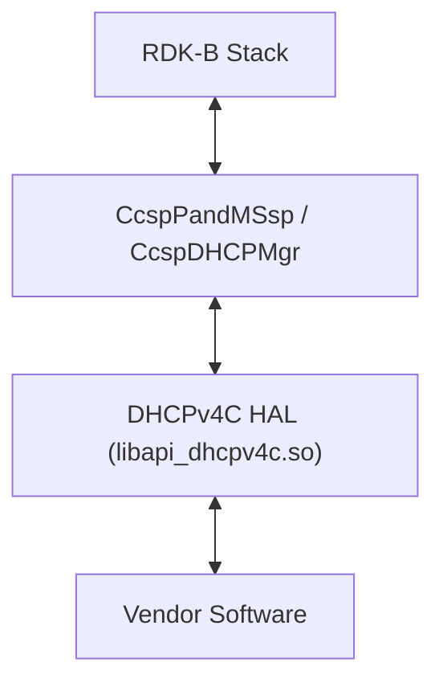
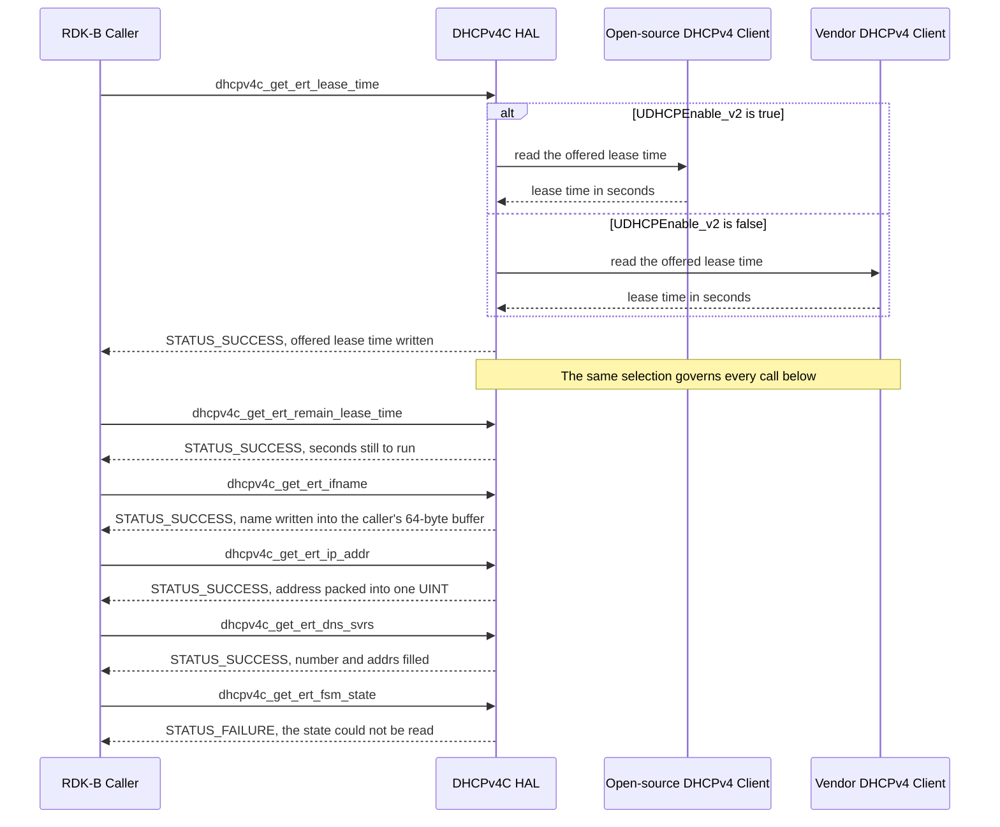

# DHCPv4C HAL Documentation

## Version History

| Date | Comment | Version |
| --- | --- | --- |
| 2024-07-13 | Initial publication, alongside the migration of the DHCPv4 client headers to GitHub. | 1.0.0 |
| Not recorded | Corrected variable names in `dhcpv4c_api.h`. `CHANGELOG.md` carries this release as a bare compare link with no date, so no date is asserted here. | 1.0.1 |
| 2026-08-24 | Specification rebuilt against the two headers: the API narrative replaced with the 54 declared accessors, the topic set brought to the canonical form, and a previously documented client lifecycle and DHCPv4 server surface removed because neither is declared. | Unreleased |

**Provenance of this page.** It was renamed from `docs/pages/DHCPv4ChalSpec.md` to `docs/pages/halSpec.md` in the same change that rewrote it against the canonical topic set. Git records a rename only where the two versions still resemble each other, and a full rewrite does not, so `git log --follow -- docs/pages/halSpec.md` begins at that change: the revisions before it are reached with `git log -- docs/pages/DHCPv4ChalSpec.md`. That resemblance is measured, and the threshold is 50% by default, so lowering it to git's floor \- `git log --follow -M1% -- docs/pages/halSpec.md` \- is worth trying first: where it pairs the two paths it shows both stretches of history in one listing, and where the rewrite kept too little of the original for git to pair them at any threshold the second command above remains the only route to the earlier revisions.

Four version identities apply to this repository. They are kept apart deliberately, because
conflating them misstates what a caller is compiling against.

- **Document revision** \- the `Version` column above. It tracks this specification, not the
  interface.
- **Interface version** \- **not exposed programmatically.** Neither header defines a version
  macro, so a caller can query the interface version neither at compile time nor at run time.
  Nothing in this repository establishes one, and none is asserted here.
- **Release tag** \- `1.0.1` is the nearest ancestor tag of the revision this document describes.
  The repository also carries a `1.1.0` tag, which is not an ancestor of that revision and
  therefore does not describe it.
- **Generated-site version string** \- `docs/generate_docs.sh` passes the output of
  `git describe --tags` as `PROJECT_VERSION`. It takes the form `1.0.1-<n>-g<abbrev>`, denoting
  `<n>` commits past tag `1.0.1`, and is **not** a version.

*Sources: `CHANGELOG.md`; this repository's tags; [`../generate_docs.sh`](../generate_docs.sh).*

## Acronyms

- `API` \- Application Programming Interface
- `DHCP` \- Dynamic Host Configuration Protocol
- `DHCPC` \- DHCP Client, as used in the enumeration names in `dhcp4cApi.h`
- `DHCPv4` \- DHCP for IPv4, the protocol version this interface reports on
- `DHCPv4C` \- DHCPv4 Client, the subject of this interface
- `DNS` \- Domain Name System
- `ECM` \- Embedded Cable Modem
- `eMTA` \- Embedded Multimedia Terminal Adapter
- `E-Router` \- Embedded Router, the routed IPv4 interface of an RDK-B gateway
- `FSM` \- Finite State Machine, the state model a DHCPv4 client runs
- `HAL` \- Hardware Abstraction Layer
- `IPv4` \- Internet Protocol version 4
- `RDK-B` \- Reference Design Kit for Broadband Devices
- `SLA` \- Service Level Agreement

## Description

The diagram below describes a high-level software architecture of the DHCPv4C HAL module stack.

The DHCPv4C HAL is the interface through which RDK-B middleware reads the state of the DHCPv4
clients running on a broadband gateway. `CcspPandMSsp` and `CcspDHCPMgr` are the RDK-B services
that own this HAL; a caller elsewhere in the stack normally reaches DHCPv4 state through one of
them rather than linking the HAL directly.

For each of three modules \- the E-Router, the ECM and the eMTA \- the interface reports values a
DHCPv4 client has already learned: the offered lease time and the lease, renewal and rebind time
still to run; the number of configuration attempts made; the name of the interface the client is
bound to; the client's FSM state; and the IPv4 configuration it was given, namely its address,
subnet mask, default gateway, DNS server list and the address of the DHCPv4 server that answered
it.

The interface is **read-only throughout**. It declares no initialization, teardown, start, stop or
renew entry point, no setter, no callback registration and no context handle, so there is nothing
for a caller to open or close before reading a value. It has no DHCPv4 *server* surface and no
DHCPv6 or IPv6 accessor: a caller needing any of those is looking at the wrong interface rather
than at a gap to work around.

Two headers deliver the same surface in different types, and a caller chooses between them on type
compatibility with its own build rather than on capability:

- [`include/dhcp4cApi.h`](../../include/dhcp4cApi.h) declares the `dhcp4c_*` family in plain C
  types \- `int`, `unsigned int` and `char` \- and reports address lists in `ipv4AddrList_t`.
- [`include/dhcpv4c_api.h`](../../include/dhcpv4c_api.h) declares the `dhcpv4c_*` family in the RDK
  compatibility macros `INT`, `UINT` and `CHAR`, and reports address lists in
  `dhcpv4c_ip_list_t`.

Every accessor in both families is synchronous and must not block the caller's main thread, but the
interface is expected to block while the underlying network hardware is not yet ready. A caller on
a latency-sensitive path must therefore treat any of these calls as potentially slow around
start-up and prompt thereafter.

DHCPv4C HAL is an abstraction layer, implemented to interact with the underlying software through a
standard set of APIs to get offered lease time, remaining lease time, remaining time to renew, DHCP
state and the IPv4 configuration a client was given.

*Sources: [`include/dhcp4cApi.h`](../../include/dhcp4cApi.h) and
[`include/dhcpv4c_api.h`](../../include/dhcpv4c_api.h) for the declared surface and the types;
the superproject `README.md` service-dependency table for the owning services.*

## Optional Components

One element of this interface is optional, and it is optional at compile time rather than at run
time: the eMTA accessors, together with the enumerator that names the eMTA module. Both families
declare their three eMTA accessors inside `#if !defined (NO_MTA_FEATURE_SUPPORT)`, and
`dhcp4cApi.h` guards the `DHCPC_EMTA` enumerator with the same flag.

- `dhcp4c_get_emta_remain_lease_time`, `dhcp4c_get_emta_remain_renew_time` and
  `dhcp4c_get_emta_remain_rebind_time` \- declared only when `NO_MTA_FEATURE_SUPPORT` is not
  defined.
- `dhcpv4c_get_emta_remain_lease_time`, `dhcpv4c_get_emta_remain_renew_time` and
  `dhcpv4c_get_emta_remain_rebind_time` \- the same three values in the RDK compatibility types,
  under the same guard.
- `DHCPC_EMTA` \- the eMTA member of the `DHCPC_MODULE` enumeration.

The guard adds or removes `DHCPC_EMTA` and nothing else. `DHCPC_ECM` is 0 and `DHCPC_EROUTER` is 1
in **both** arms, because `DHCPC_EROUTER` is written once in each arm rather than moved between
them, so a caller must not read the guard as reordering the enumeration.

The eMTA module is also narrower than the other two even when it is present: it exposes only the
three remaining-time accessors, and has no offered-lease-time, attempt-count, interface-name,
state, address, mask, gateway, DNS or server accessor in either family.

Nothing else in this interface is optional. The E-Router and ECM accessors of both families, and
every type and constant either header defines, are declared unconditionally.

*Sources: [`include/dhcp4cApi.h`](../../include/dhcp4cApi.h) lines 137-145 for the enumeration
and its guard, and lines 1052-1158 for the guarded accessors;
[`include/dhcpv4c_api.h`](../../include/dhcpv4c_api.h) lines 1001-1107 for the guarded accessors
of the second family.*

## Component Runtime Execution Requirements

### Initialization and Startup

**This interface has no initialization call and no teardown call.** Neither header declares an
init, deinit, open, close, start or stop entry point, and neither declares a context or handle
type, so a caller reads a value without opening or closing a session and without arranging its
calls around a lifecycle. Any accessor may be the first one a caller invokes.

What has to be in place before a value can be read is the implementation's concern rather than the
caller's:

- **Implementation selection.** The DHCPv4 client HAL implementation dynamically selects between
  open-source and proprietary DHCPv4c APIs based on the value of the `UDHCPEnable_v2` configuration
  parameter. If `UDHCPEnable_v2` is true, the HAL uses the open-source DHCPv4c APIs; if it is
  false, the HAL uses the proprietary ones. The selection changes which software answers a call; it
  changes neither the signature of that call nor its return convention, so it is invisible to a
  caller's source.
- **Hardware readiness.** Vendors must ensure the HAL waits for the underlying network hardware to
  be ready before initiating any DHCP operation. This may involve checking for a valid network
  interface and link status.
- **Error handling.** Vendors must implement robust error handling for the cases where
  `UDHCPEnable_v2` is not set, is invalid, or is inaccessible.

Third-party vendors will implement appropriately to meet operational requirements. This interface
is expected to block if the hardware is not ready.

Because there is no lifecycle to establish, the accessors a caller reaches for first are simply the
ones carrying the values it needs. The E-Router set below is representative, and the order is the
reader's convenience rather than a requirement of the interface:

- `dhcpv4c_get_ert_ifname`
- `dhcpv4c_get_ert_fsm_state`
- `dhcpv4c_get_ert_ip_addr`
- `dhcpv4c_get_ert_mask`
- `dhcpv4c_get_ert_gw`
- `dhcpv4c_get_ert_lease_time`
- `dhcpv4c_get_ert_remain_lease_time`
- `dhcpv4c_get_ert_dns_svrs`

The `dhcp4c_*` family exposes the same eight values under the same names with the `dhcpv4c_` prefix
replaced by `dhcp4c_`.

*Sources: [`include/dhcp4cApi.h`](../../include/dhcp4cApi.h) and
[`include/dhcpv4c_api.h`](../../include/dhcpv4c_api.h) for the absence of any lifecycle entry
point; the preceding revision of this specification for the `UDHCPEnable_v2` selection and the
vendor implementation notes.*

### Threading Model

This interface is not required to be thread safe.

Any module which is invoking the API should ensure calls are made in a thread safe manner.

Vendors may implement internal threading and event mechanisms to meet their operational
requirements. These mechanisms must be designed to ensure thread safety when interacting with the
HAL interface. Proper cleanup of allocated resources \- memory, file handles and threads \- is
mandatory when the vendor software terminates or closes its connection to the HAL.

The vendor's obligation does not relieve the caller of its own: a caller that shares an accessor
between threads must serialise those invocations itself.

*Source: the preceding revision of this specification, restated identically in the Doxygen blocks
of [`include/dhcpv4c_api.h`](../../include/dhcpv4c_api.h).*

### Process Model

All APIs are expected to be called from multiple processes. Due to this concurrent access, vendors
must implement protection mechanisms within their API implementations to handle multiple processes
calling the same API simultaneously. This is crucial to ensure data integrity, prevent race
conditions, and maintain the overall stability and reliability of the system.

*Source: the preceding revision of this specification, restated identically in the Doxygen blocks
of [`include/dhcpv4c_api.h`](../../include/dhcpv4c_api.h).*

### Memory Model

Every accessor in this interface writes through exactly one caller-supplied output location, and no
accessor allocates memory on the caller's behalf: neither header declares an accessor that returns a
pointer and neither declares a release call, so nothing crosses this interface that a caller must
free. **What neither header states is whether an accessor retains the caller's pointer once it has
returned.** That gap is recorded here rather than closed by inference, and the obligations that
follow from it are stated separately below.

#### Caller Responsibilities

- The caller owns and allocates the output location for every call, whether it is a scalar, a
  character buffer or an address-list structure. Because retention is unstated, a caller keeps that
  storage valid rather than treating the call's return as the moment it becomes free to release or
  reuse, and does not rely on the accessor having copied out of it. Nothing in either header forbids
  a local variable, but a caller that uses one is taking on the assumption that the accessor did not
  keep the address, and this interface does not underwrite that assumption.
- The buffer passed to `dhcp4c_get_ert_ifname`, `dhcp4c_get_ecm_ifname`,
  `dhcpv4c_get_ert_ifname` or `dhcpv4c_get_ecm_ifname` must be **at least 64 bytes**. The accessor
  receives a bare pointer and no length, so the interface cannot detect a shorter buffer; a buffer
  smaller than 64 bytes risks an overrun and is the caller's error to avoid.
- After a successful list read, the caller reads only the entries the accessor reported: index `0`
  through `number - 1` of `ipv4AddrList_t` or `dhcpv4c_ip_list_t`. The array is always
  `MAX_IPV4_ADDR_LIST_NUMBER` or `DHCPV4_MAX_IPV4_ADDRS` entries wide regardless of how many were
  filled.
- After a failed call the content of the output location is not specified by this interface. A
  caller must not treat it as unmodified, and must not read a character buffer from a failed call
  as a string.

#### Module Responsibilities

- Modules must allocate and de-allocate memory for their internal operations, ensuring efficient
  resource management.
- Modules are required to release all internally allocated memory upon closure to prevent resource
  leaks.
- All module implementations and caller code must strictly adhere to these memory management
  requirements for optimal performance and system stability, unless otherwise stated specifically
  in the API documentation.
- All strings used in this module must be zero-terminated. This ensures that string functions can
  accurately determine the length of the string and prevents buffer overflows when manipulating
  strings.
- No accessor allocates storage the caller is expected to release. That much follows from the
  declarations themselves: none returns a pointer and neither header declares a release call.
- **Retention is a separate question and this specification does not settle it.** Neither header
  states whether an accessor may hold the caller's pointer beyond the call, so an implementation that
  does hold one contradicts nothing in this interface, and this specification does not impose a
  prohibition the interface never made. The obligation the gap creates falls on the caller and is
  stated under `Caller Responsibilities`.
- An accessor writing into a character buffer must write no more than that buffer holds.

**Memory footprint.** No memory footprint limit is specified for this interface. Neither header
states a ceiling on the DHCPv4 client module's internal data structures, on the memory its
accessors use, or on allocations a vendor implementation makes, and nothing else in this repository
states one either, so a caller must not infer a figure. The proportionality expectation that does
apply is stated under `Memory and performance requirements`.

*Sources: [`include/dhcpv4c_api.h`](../../include/dhcpv4c_api.h) lines 145-150 for the argument
ownership convention and lines 348-377 for the 64-byte buffer minimum;
[`include/dhcp4cApi.h`](../../include/dhcp4cApi.h) lines 389 and 801 for the same minimum in the
plain-C family; the preceding revision of this specification for the module obligations.*

### Power Management Requirements

The HAL is not involved in any of the power management operation.

*Source: the preceding revision of this specification for the statement itself, measured against the
declared surface of `include/dhcp4cApi.h` and `include/dhcpv4c_api.h`. Neither header declares a
power-management entry point, a power-state type, or a suspend or resume notification: every one of
the 54 declarations is a getter for a lease duration, a remaining timer, a configuration-attempt
count, an address, an interface name or a DHCP state value, so there is nothing here for a caller to
drive and nothing for an implementation to honour.*

### Asynchronous Notification Model

There are no asynchronous notifications. Neither header declares a callback type, a registration
function or an event handle, so a caller that needs to know when a lease changes must poll the
accessors it cares about. This interface offers no push mechanism of any kind.

*Sources: the preceding revision of this specification;
[`include/dhcpv4c_api.h`](../../include/dhcpv4c_api.h) lines 176-178 for the absence of any
callback registration.*

### Blocking calls

- **Synchronous and Responsive:** All APIs within this module should operate synchronously and
  complete within a reasonable timeframe based on the complexity of the operation. Specific timeout
  values or guidelines may be documented for individual API calls.

- **Timeout Handling:** To ensure resilience in cases of unresponsiveness, implement appropriate
  timeouts for API calls where failure due to lack of response is a possibility. Refer to the API
  documentation for recommended timeout values per function.

- **Non-Blocking Requirement:** Given the single-threaded environment in which these APIs will be
  called, it is imperative that they do not block or suspend execution of the main thread.
  Implementations must avoid long-running operations or utilize asynchronous mechanisms where
  necessary to maintain responsiveness.

**Timeout values.** No numeric timeout is specified for this interface. Neither header states a
per-call timeout, and this repository states no bound on how long a vendor implementation may take
to release its internal allocations, so no figure is asserted here. The requirement above is that a
call complete within a time reasonable for the work it does; a vendor's own documentation is the
only place a numeric bound could come from.

The one qualification to the non-blocking requirement is the start-up case stated under
`Description` and `Initialization and Startup`: the interface is expected to block while the
underlying hardware is not yet ready. Both statements hold together, so a caller treats these calls
as potentially slow around start-up and prompt thereafter.

*Sources: the preceding revision of this specification;
[`include/dhcpv4c_api.h`](../../include/dhcpv4c_api.h) lines 162-167 for the same pairing on each
declaration.*

### Internal Error Handling

- **Synchronous Error Handling:** All APIs must return errors synchronously as a return value. This
  ensures immediate notification of errors to the caller.
- **Internal Error Reporting:** The HAL is responsible for reporting any internal system errors,
  such as an out-of-memory condition, through the return value.
- **Focus on Logging for Errors:** For system errors, the HAL should prioritize logging the error
  details for further investigation and resolution.

Every accessor in both families returns the status value `0` or the status value `-1`, and nothing
else. The two names this document and both headers use for those values, `STATUS_SUCCESS` and
`STATUS_FAILURE`, are declared in exactly one place:
[`include/dhcpv4c_api.h`](../../include/dhcpv4c_api.h) lines 104 and 108, as `#ifndef`-guarded
fallbacks a platform may override.

The two families do not share that declaration, and a caller of the plain-C family must not assume
they do. `dhcp4cApi.h` cites both names in every one of its return-value descriptions, defines
neither, and **contains no `#include` directive at all** \- so a translation unit that includes only
`dhcp4cApi.h` has no definition of either name and will not compile a reference to one. In that
header the names are documentation references to `0` and `-1` rather than symbols the header
supplies. A caller of the `dhcp4c_*` family therefore obtains the two macros itself, by also
including `dhcpv4c_api.h`, or from its own compatibility layer, or by comparing the return value
against the literals `0` and `-1` directly. Because the definitions in `dhcpv4c_api.h` are
guarded fallbacks rather than fixed values, a caller that supplies its own must confirm they are
still `0` and `-1`; comparing against the literals is always correct.

This interface deliberately defines no granular error enumeration. One failure code therefore
covers a rejected argument, a value the DHCPv4 client has not yet learned, and an internal
retrieval error alike. A caller cannot tell those apart from the return value, and the actions open
to it are to re-check the pointer and buffer it passed, and otherwise to treat the value as
currently unavailable and re-read later \- never to substitute a default such as zero for a value
the interface declined to report.

*Sources: the preceding revision of this specification;
[`include/dhcpv4c_api.h`](../../include/dhcpv4c_api.h) lines 103-108 for the two macros and lines
152-160 for the return convention; [`include/dhcp4cApi.h`](../../include/dhcp4cApi.h) for the
absence of any `#include` directive and of either macro definition, stated in that header's own
macro-availability note.*

### Persistence Model

There is no requirement for HAL to persist any setting information.

*Source: the preceding revision of this specification, restated in
[`include/dhcpv4c_api.h`](../../include/dhcpv4c_api.h) lines 47-50.*

## Non functional requirements

Following non functional requirement should be supported by the component.

### Logging and debugging requirements

The component should log all the error and critical informative messages, preferably using
`syslog`, which helps to debug and triage the issues and understand the functional flow of the
system.

The logging should be consistent across all HAL components.

The component is required to record all errors and critical informative messages to aid in
identifying, debugging, and understanding the functional flow of the system. Logging should be
implemented using the `syslog` method, as it provides robust logging capabilities suited for
system-level software. The use of `printf` is discouraged unless `syslog` is not available.

All HAL components must adhere to a consistent logging process. When logging is necessary, it
should be performed into the `dhcp_vendor_hal.log` file, which is located in either the `/var/tmp/`
or `/rdklogs/logs/` directories.

Logs must be categorized according to the following log levels, as defined by the Linux standard
logging system, listed here in descending order of severity:

- **FATAL:** Critical conditions, typically indicating system crashes or severe failures that
  require immediate attention.
- **ERROR:** Non-fatal error conditions that nonetheless significantly impede normal operation.
- **WARNING:** Potentially harmful situations that do not yet represent errors.
- **NOTICE:** Important but not error-level events.
- **INFO:** General informational messages that highlight system operations.
- **DEBUG:** Detailed information typically useful only when diagnosing problems.
- **TRACE:** Very fine-grained logging to trace the internal flow of the system.

Each log entry should include a timestamp, the log level, and a message describing the event or
condition. This standard format will facilitate easier parsing and analysis of log files across
different vendors and components.

Because a failure of any accessor in this interface carries no detail beyond `STATUS_FAILURE`, a
log entry is the only place the reason for that failure can be recorded. An implementation that
returns `STATUS_FAILURE` without logging why leaves a caller no way to distinguish a rejected
argument from a value the DHCPv4 client has not yet learned.

*Source: the preceding revision of this specification.*

### Memory and performance requirements

The component should be designed for efficiency, minimizing its impact on system resources during
normal operation. Resource utilization, of CPU and memory alike, should be proportional to the
specific task being performed and align with any performance expectations documented in the API
specifications.

No numeric ceiling accompanies that expectation; see the memory-footprint statement under
`Memory Model`.

*Source: the preceding revision of this specification for the proportionality expectation, and
`include/dhcp4cApi.h` and `include/dhcpv4c_api.h` for the absence of a numeric one. Neither header
declares a footprint, CPU-load or completion-time constant, and the only timing statement either
makes is at `include/dhcp4cApi.h` lines 155-160, which requires the accessors to operate
synchronously and records that no numeric timeout is specified for any call in the header.*

### Quality Control

To ensure the highest quality and reliability, it is strongly recommended that third-party quality
assurance tools like `Coverity`, `Black Duck` and `Valgrind` be employed to thoroughly analyze the
implementation. The goal is to detect and resolve potential issues such as memory leaks, memory
corruption, or other defects before deployment.

Furthermore, both the HAL wrapper and any third-party software interacting with it must prioritize
robust memory management practices. This includes meticulous allocation, deallocation, and error
handling to guarantee a stable and leak-free operation.

**Keeping this document accurate.** Every topic above and below closes with a `Source:` note naming
the artefacts its own content was derived from, rather than relying on a single statement here. The
artefacts named across this document are `include/dhcp4cApi.h` and `include/dhcpv4c_api.h` for every
interface fact; the repository-root `CHANGELOG.md` and this repository's tags for `Version History`;
`docs/generate_docs.sh` for the generated-site version string; the superproject `README.md` for the
owning services; `CONTRIBUTING.md` for the review route; `LICENSE.md` and `NOTICE.md` in this
directory for `Licensing`; and the preceding revision of this specification wherever a statement is
carried forward that the two headers do not themselves establish. Any change to one of those files
obliges a review of the topics that cite it \- a renamed or added accessor invalidates `API Surface`,
a changed type or constant invalidates `Data Structures and Defines`, and a changed state list
invalidates `State Diagram`. This repository declares no `CODEOWNERS`, so that review is raised
through the route `CONTRIBUTING.md` prescribes: open an issue against the repository, raise a pull
request, and the team reviews and merges it.

*Sources: the preceding revision of this specification;
`CONTRIBUTING.md` lines 5-11 for the review route.*

### Licensing

The implementation is expected to released under the Apache License 2.0.

*Source: the preceding revision of this specification; the repository's
[`LICENSE.md`](LICENSE.md) and [`NOTICE.md`](NOTICE.md).*

### Build Requirements

The source code should be capable of, but not be limited to, building under the Yocto distribution
environment. The recipe should deliver a shared library named as `libapi_dhcpv4c.so`.

A consumer of this interface therefore:

1. includes both `dhcp4cApi.h` and `dhcpv4c_api.h`, or whichever of the two matches the types it
   builds in, to make use of DHCPv4C HAL capabilities;
2. adds a linker dependency for `libapi_dhcpv4c.so`.

This repository ships the interface headers and no implementation of them, so `libapi_dhcpv4c.so`
is the artefact this specification requires of an implementer rather than one built here. No other
library, toolchain version or build dependency is specified by this repository, and none is
asserted here.

*Sources: the preceding revision of this specification;
[`include/dhcp4cApi.h`](../../include/dhcp4cApi.h) and
[`include/dhcpv4c_api.h`](../../include/dhcpv4c_api.h) as the headers a consumer includes.*

### Variability Management

Changes to the interface will be controlled by versioning, vendors will be expected to implement to
a fixed version of the interface, and based on SLA agreements move to later versions as demand
requires.

Each API interface will be versioned using [Semantic Versioning 2.0.0](https://semver.org/spec/v2.0.0.html), the
vendor code will comply with a specific version of the interface. Note that this interface exposes
no version macro, so the version a caller is compiling against is established from the release tag
rather than read from a header; see `Version History`.

Two flags vary the behaviour or the shape of this interface, and they vary different things:

| Flag | Kind | Effect |
| --- | --- | --- |
| `UDHCPEnable_v2` | Run-time configuration parameter | Selects which DHCPv4 client software answers a call: the open-source DHCPv4c APIs when true, the proprietary ones when false. The declared surface is identical either way. |
| `NO_MTA_FEATURE_SUPPORT` | Compile-time flag | When defined, removes the three eMTA accessors from each family and the `DHCPC_EMTA` enumerator. The declared surface differs. |

`NO_MTA_FEATURE_SUPPORT` needs care because it changes the API surface rather than the
implementation behind it. A caller compiled against a header where the flag differs from the
setting the implementation was built with sees a different set of declarations than the library
provides, so integrators must apply the flag consistently across the caller and the implementation.

*Sources: the preceding revision of this specification for the versioning policy;
[`include/dhcp4cApi.h`](../../include/dhcp4cApi.h) lines 139-144 and 1052-1158, and
[`include/dhcpv4c_api.h`](../../include/dhcpv4c_api.h) lines 1001-1107, for
`NO_MTA_FEATURE_SUPPORT`.*

### Platform or Product Customization

Two points of variation are open to a platform or product integrator, and both are the flags named
under `Variability Management`: `UDHCPEnable_v2`, which selects which DHCPv4 client software answers
a call, and `NO_MTA_FEATURE_SUPPORT`, which determines whether the eMTA accessors and the
`DHCPC_EMTA` enumerator exist at all.

Nothing else in this interface is customizable, and the following in particular are fixed by the
headers rather than configurable per platform or product:

- the declared signatures of all 54 accessors, and their read-only nature \- there is no setter to
  customize behaviour through;
- the `STATUS_SUCCESS` and `STATUS_FAILURE` return convention, and the absence of any granular
  error enumeration;
- the 64-byte minimum for an interface-name buffer;
- the `MAX_IPV4_ADDR_LIST_NUMBER` and `DHCPV4_MAX_IPV4_ADDRS` list capacity of 4 addresses;
- the set of three modules the interface reports on, and the FSM state values it reports.

A platform that needs a value this interface does not report cannot obtain it by configuring the
HAL; the interface would have to change.

*Sources: [`include/dhcp4cApi.h`](../../include/dhcp4cApi.h) and
[`include/dhcpv4c_api.h`](../../include/dhcpv4c_api.h) for every fixed element listed.*

## Interface API Documentation

All HAL function prototypes and datatype definitions are available in the
[`include/dhcp4cApi.h`](../../include/dhcp4cApi.h) and
[`include/dhcpv4c_api.h`](../../include/dhcpv4c_api.h) files. `dhcp4cApi.h` is also the Doxygen
group anchor for this repository: it declares the `DHCPV4C_HAL` group with its `DHCPV4C_HAL_TYPES`
and `DHCPV4C_HAL_APIS` subgroups, which `dhcpv4c_api.h` re-opens rather than redefining.

### Theory of operation and key concepts

This interface reports the state of DHCPv4 clients; it does not drive them. A vendor
implementation runs, or reads from, a DHCPv4 client for each of up to three modules \- the
E-Router, the ECM and the eMTA \- and each accessor answers one question about one of them. The
concepts a caller needs are therefore few: which module a value belongs to, which of the two
families it is calling, and what the single failure code means.

**Two families, one surface.** The 54 accessors are 27 matched pairs plus nothing else: every
accessor in the `dhcp4c_` family has a counterpart in the `dhcpv4c_` family reporting the same
value about the same module, and the two names differ only by that prefix. They differ only in
types \- plain C against the RDK compatibility macros \- and in the address-list structure they
fill. A caller picks the family its own build's types agree with and
uses it throughout; mixing the two in one translation unit is legal but gains nothing.

**One value per call.** No accessor reports two values, and none accepts a selector telling it
which value to report. The `DHCPC_CMD` and `DHCPC_MODULE` enumerations describe the value and
module space this interface covers, but no declared signature takes either, so a caller selects a
value by choosing a function name rather than by passing an enumerator.

#### Object Lifecycles

**There is no object.** This interface creates nothing and destroys nothing: it declares no
constructor, no destructor, no handle and no context type, and no accessor takes or returns one.
Every accessor reads the state of a DHCPv4 client the vendor implementation is already running and
returns immediately.

The only lifetime a caller manages is that of the storage it passes in, and this interface does not
state how long an accessor may hold the pointer to it. The caller therefore keeps that storage valid
while it continues to read through this interface and releases it on its own terms afterwards; see
`Memory Model`, which records the gap and what it obliges.

#### Method Sequencing

**The accessors are independent and impose no ordering.** There is no call a caller must make
first, none it must make last, and no pair whose relative order changes what either returns. A
caller may invoke one accessor and never another, or all 54 in any order.

Two consequences follow, and both matter to a caller building a view of DHCPv4 state:

- Successive calls are independent reads of a client that keeps running between them. A caller
  needing a consistent view of several values must be prepared for them to disagree \- a state read
  as `5` alongside a remaining lease time that has since reached zero, for instance. This interface
  offers no atomic multi-value read and no snapshot.
- A failure carries no ordering remedy. Because there is no initialization call, a `STATUS_FAILURE`
  never means "call something else first"; it means the value is unavailable now, and re-reading
  later is the only recourse.

#### State-Dependent Behavior

What an accessor returns depends on the state of the DHCPv4 client it reports on, and that state is
itself readable. Four accessors report it \- `dhcp4c_get_ert_fsm_state`,
`dhcp4c_get_ecm_fsm_state`, `dhcpv4c_get_ert_fsm_state` and `dhcpv4c_get_ecm_fsm_state` \- one per
module per family, the eMTA module having no state accessor in either family.

The practical consequence for a caller is that a value the client has not yet learned is reported
as a failure rather than as a defined "not yet" result. An address accessor called before a lease
has been granted, or a remaining-time accessor called while no lease is held, returns
`STATUS_FAILURE`, which is the same code a rejected pointer returns. A caller must therefore read
`STATUS_FAILURE` as "not available now" as well as "not working", and use the state accessor to
tell which situation it is in.

**The interface constrains no transition.** It reports the current state as an integer and stops
there: it does not declare which states may follow which, how long a state persists, or that any
sequence of states is guaranteed. The values are enumerated under `State Diagram`, with the reason
no diagram accompanies them.

*Sources: [`include/dhcp4cApi.h`](../../include/dhcp4cApi.h) lines 107-172 for the enumerations
and types, and lines 437-442 for the state values;
[`include/dhcpv4c_api.h`](../../include/dhcpv4c_api.h) lines 138-179 for the group-wide argument,
return, blocking and thread-safety conventions and for the list of what this interface does not
declare.*

### Data Structures and Defines

The two headers define separate, non-interchangeable type sets. `ipv4AddrList_t` belongs to
`dhcp4cApi.h` alone and `dhcpv4c_ip_list_t` to `dhcpv4c_api.h` alone; neither header includes the
other, so a caller cannot pass one family's list structure to the other family's accessor. The two
sets are therefore listed separately below.

**`dhcp4cApi.h` \- the plain-C family.**

| Definition | Kind | Declared at | What it represents |
| --- | --- | --- | --- |
| `DHCPC_CMD` | Enumeration, 13 members | lines 107-121 | The value space this interface covers: one member per kind of DHCPv4 client information it reports. |
| `DHCPC_MODULE` | Enumeration, 2 or 3 members | lines 137-145 | The modules this interface reports on. `DHCPC_EMTA` is present only when `NO_MTA_FEATURE_SUPPORT` is undefined. |
| `MAX_IPV4_ADDR_LIST_NUMBER` | Macro constant, `4` | line 147 | Capacity of `ipv4AddrList_t::addrList`, and the most addresses a DNS server list ever reports. |
| `ipv4AddrList_t` | Structure typedef | lines 168-172 | A list of IPv4 addresses, filled by the two DNS server accessors of this family. |

`DHCPC_CMD` members, in declaration order: `DHCPC_CMD_LEASE_TIME`, `DHCPC_CMD_LEASE_TIME_REMAIN`,
`DHCPC_CMD_RENEW_TIME_REMAIN`, `DHCPC_CMD_REBIND_TIME_REMAIN`, `DHCPC_CMD_CONFIG_ATTEMPTS`,
`DHCPC_CMD_GET_IFNAME`, `DHCPC_CMD_FSM_STATE`, `DHCPC_CMD_IP_ADDR`, `DHCPC_CMD_IP_MASK`,
`DHCPC_CMD_ROUTERS`, `DHCPC_CMD_DNS_SVRS`, `DHCPC_CMD_DHCP_SVR` and `DHCPC_CMD_MAX`, the last being
a bound rather than a value.

`DHCPC_MODULE` members: `DHCPC_ECM` is 0, `DHCPC_EROUTER` is 1, and `DHCPC_EMTA` is 2 when
declared. Both ordinals below `DHCPC_EMTA` are the same in either arm of the guard; see
`Optional Components`.

`ipv4AddrList_t` fields: `int number`, the count of entries filled, and
`unsigned int addrList[MAX_IPV4_ADDR_LIST_NUMBER]`, the addresses themselves, each packed into a
single 32-bit word rather than held as a dotted-quad string. A caller reads `addrList[0]` through
`addrList[number - 1]` and no further.

**`dhcpv4c_api.h` \- the RDK compatibility family.**

| Definition | Kind | Declared at | What it represents |
| --- | --- | --- | --- |
| `DHCPV4_MAX_IPV4_ADDRS` | Macro constant, `4` | line 115 | Capacity of `dhcpv4c_ip_list_t::addrs`, matching the other family's cap. |
| `dhcpv4c_ip_list_t` | Structure typedef | lines 132-135 | A list of IPv4 addresses, filled by the two DNS server accessors of this family. |

`dhcpv4c_ip_list_t` fields: `INT number`, the count of entries filled, and
`UINT addrs[DHCPV4_MAX_IPV4_ADDRS]`, the addresses, again packed one to a 32-bit word. This
interface does not specify their byte order, so a caller confirms it with the vendor implementation
rather than assuming host or network order.

The same header also carries eleven `#ifndef`-guarded compatibility definitions, listed here
because they decide the signature of every declaration in that family:

| Definition | Value | Declared at | Referenced by a declaration? |
| --- | --- | --- | --- |
| `INT` | `int` | line 84 | Yes \- the return type of every accessor, and the output type of the state and attempt-count accessors. |
| `UINT` | `unsigned int` | line 88 | Yes \- carries lease timers in seconds and packed 32-bit addresses. |
| `CHAR` | `char` | line 76 | Yes \- the two interface-name accessors take `CHAR *`, so their buffers are sized in bytes. |
| `STATUS_SUCCESS` | `0` | line 104 | Yes \- the success code of both families. |
| `STATUS_FAILURE` | `-1` | line 108 | Yes \- the only failure code either family defines. |
| `ULONG` | `unsigned long` | line 68 | No. |
| `BOOL` | `unsigned char` | line 72 | No. |
| `UCHAR` | `unsigned char` | line 80 | No. |
| `TRUE` | `1` | line 92 | No. |
| `FALSE` | `0` | line 96 | No. |
| `ENABLE` | `1` | line 100 | No. |

Two properties of that table are easy to miss and both affect a caller:

- These are **fallbacks, not definitions the header insists on.** Each yields to whatever the
  including environment has already defined, so a platform that defines `INT`, `UINT` or `CHAR`
  differently silently changes the signature of every declaration in this family. A caller that
  mixes this header with its own compatibility layer must confirm the two agree.
- `STATUS_SUCCESS` and `STATUS_FAILURE` are defined **here and nowhere else in this repository**,
  yet `dhcp4cApi.h` cites them in all of its return-value descriptions. That header defines
  neither and contains no `#include` directive, so **including `dhcp4cApi.h` alone does not make
  either name available**: in that header the names are documentation references to `0` and `-1`.
  A caller of the plain-C family supplies them itself, by also including this header, by using its
  own compatibility layer, or by comparing the return value against the literals. See
  `Internal Error Handling`.

There are **no callback typedefs** to document in either header, and neither `DHCPC_CMD` nor
`DHCPC_MODULE` appears in any declared signature: both describe the interface's coverage rather
than parameterising a call.

*Sources: [`include/dhcp4cApi.h`](../../include/dhcp4cApi.h) lines 73-84 for the Doxygen groups
and lines 107-172 for the types; [`include/dhcpv4c_api.h`](../../include/dhcpv4c_api.h) lines 67-109 for
the compatibility definitions and lines 115-135 for the constant and structure.*

### API Surface

This interface declares **54 accessors** and nothing else: 27 in each family, and within each
family 12 for the E-Router, 12 for the ECM and 3 for the eMTA. Every one of them takes a single
caller-owned output location, writes one value through it and returns the status value `0` on
success or `-1` on failure; none takes an input parameter, a selector or a handle. Those two values
are the ones `dhcpv4c_api.h` declares as `STATUS_SUCCESS` and `STATUS_FAILURE`, and which a caller
of the `dhcp4c_*` family must obtain for itself \- see `Internal Error Handling`.

`API Surface` is the boundary of this document. The topics above it answer what the interface is
and how to call it; this topic and the ones below it carry the per-call and per-state detail.
Declaration-level documentation for each accessor is the Doxygen block on the declaration itself,
in [`include/dhcp4cApi.h`](../../include/dhcp4cApi.h) and
[`include/dhcpv4c_api.h`](../../include/dhcpv4c_api.h).

**The `dhcp4c_*` family \- [`include/dhcp4cApi.h`](../../include/dhcp4cApi.h).** Plain C types;
address lists in `ipv4AddrList_t`.

*E-Router module \- 12 accessors.*

| Accessor | Value reported |
| --- | --- |
| `dhcp4c_get_ert_lease_time` | The whole lease duration the E-Router's DHCPv4 server offered, in seconds. Fixed when the lease was taken; it does not count down. |
| `dhcp4c_get_ert_remain_lease_time` | Seconds of the current E-Router lease still to run. |
| `dhcp4c_get_ert_remain_renew_time` | Seconds until the E-Router client next attempts to renew its lease. |
| `dhcp4c_get_ert_remain_rebind_time` | Seconds until the E-Router client falls back from renewing to rebinding. |
| `dhcp4c_get_ert_config_attempts` | Number of configuration attempts the E-Router client has made. |
| `dhcp4c_get_ert_ifname` | Name of the network interface the E-Router client is bound to, written into a caller-allocated buffer of at least 64 bytes. |
| `dhcp4c_get_ert_fsm_state` | The E-Router client's FSM state, as one of the integers listed under `State Diagram`. |
| `dhcp4c_get_ert_ip_addr` | IPv4 address leased to the E-Router, packed into a single 32-bit word. |
| `dhcp4c_get_ert_mask` | Subnet mask leased to the E-Router, packed into a single 32-bit word. |
| `dhcp4c_get_ert_gw` | Default gateway offered to the E-Router, packed into a single 32-bit word. |
| `dhcp4c_get_ert_dns_svrs` | DNS servers offered with the E-Router lease, as an `ipv4AddrList_t` of up to `MAX_IPV4_ADDR_LIST_NUMBER` entries. |
| `dhcp4c_get_ert_dhcp_svr` | Address of the DHCPv4 server that answered the E-Router, packed into a single 32-bit word. |

*ECM module \- 12 accessors, reporting the same twelve values about the Embedded Cable Modem.*

| Accessor | Value reported |
| --- | --- |
| `dhcp4c_get_ecm_lease_time` | The whole lease duration the ECM's DHCPv4 server offered, in seconds. |
| `dhcp4c_get_ecm_remain_lease_time` | Seconds of the current ECM lease still to run. |
| `dhcp4c_get_ecm_remain_renew_time` | Seconds until the ECM client next attempts to renew its lease. |
| `dhcp4c_get_ecm_remain_rebind_time` | Seconds until the ECM client falls back from renewing to rebinding. |
| `dhcp4c_get_ecm_config_attempts` | Number of configuration attempts the ECM client has made. |
| `dhcp4c_get_ecm_ifname` | Name of the network interface the ECM client is bound to, written into a caller-allocated buffer of at least 64 bytes. |
| `dhcp4c_get_ecm_fsm_state` | The ECM client's FSM state, as one of the integers listed under `State Diagram`. |
| `dhcp4c_get_ecm_ip_addr` | IPv4 address leased to the ECM, packed into a single 32-bit word. |
| `dhcp4c_get_ecm_mask` | Subnet mask leased to the ECM, packed into a single 32-bit word. |
| `dhcp4c_get_ecm_gw` | Default gateway offered to the ECM, packed into a single 32-bit word. |
| `dhcp4c_get_ecm_dns_svrs` | DNS servers offered with the ECM lease, as an `ipv4AddrList_t` of up to `MAX_IPV4_ADDR_LIST_NUMBER` entries. |
| `dhcp4c_get_ecm_dhcp_svr` | Address of the DHCPv4 server that answered the ECM, packed into a single 32-bit word. |

*eMTA module \- 3 accessors, declared only when `NO_MTA_FEATURE_SUPPORT` is undefined.*

| Accessor | Value reported |
| --- | --- |
| `dhcp4c_get_emta_remain_lease_time` | Seconds of the current eMTA lease still to run. |
| `dhcp4c_get_emta_remain_renew_time` | Seconds until the eMTA client next attempts to renew its lease. |
| `dhcp4c_get_emta_remain_rebind_time` | Seconds until the eMTA client falls back from renewing to rebinding. |

**The `dhcpv4c_*` family \- [`include/dhcpv4c_api.h`](../../include/dhcpv4c_api.h).** The same 27
values, declared in the RDK compatibility macros `INT`, `UINT` and `CHAR`, with address lists in
`dhcpv4c_ip_list_t` and its `DHCPV4_MAX_IPV4_ADDRS` cap.

*E-Router module \- 12 accessors.*

| Accessor | Value reported |
| --- | --- |
| `dhcpv4c_get_ert_lease_time` | The offered E-Router lease duration in seconds, as a `UINT`. |
| `dhcpv4c_get_ert_remain_lease_time` | Seconds of the current E-Router lease still to run. |
| `dhcpv4c_get_ert_remain_renew_time` | Seconds until the E-Router client next attempts renewal. |
| `dhcpv4c_get_ert_remain_rebind_time` | Seconds until the E-Router client falls back to rebinding. |
| `dhcpv4c_get_ert_config_attempts` | E-Router configuration attempt count, as an `INT`. |
| `dhcpv4c_get_ert_ifname` | E-Router interface name, into a caller-allocated `CHAR` buffer of at least 64 bytes. |
| `dhcpv4c_get_ert_fsm_state` | The E-Router client's FSM state, as an `INT` taking one of the values under `State Diagram`. |
| `dhcpv4c_get_ert_ip_addr` | IPv4 address leased to the E-Router, packed into one `UINT`. |
| `dhcpv4c_get_ert_mask` | Subnet mask leased to the E-Router, packed into one `UINT`. |
| `dhcpv4c_get_ert_gw` | Default gateway offered to the E-Router, packed into one `UINT`. |
| `dhcpv4c_get_ert_dns_svrs` | DNS servers offered with the E-Router lease, into a `dhcpv4c_ip_list_t`. |
| `dhcpv4c_get_ert_dhcp_svr` | Address of the DHCPv4 server that answered the E-Router, packed into one `UINT`. |

*ECM module \- 12 accessors.*

| Accessor | Value reported |
| --- | --- |
| `dhcpv4c_get_ecm_lease_time` | The offered ECM lease duration in seconds, as a `UINT`. |
| `dhcpv4c_get_ecm_remain_lease_time` | Seconds of the current ECM lease still to run. |
| `dhcpv4c_get_ecm_remain_renew_time` | Seconds until the ECM client next attempts renewal. |
| `dhcpv4c_get_ecm_remain_rebind_time` | Seconds until the ECM client falls back to rebinding. |
| `dhcpv4c_get_ecm_config_attempts` | ECM configuration attempt count, as an `INT`. |
| `dhcpv4c_get_ecm_ifname` | ECM interface name, into a caller-allocated `CHAR` buffer of at least 64 bytes. |
| `dhcpv4c_get_ecm_fsm_state` | The ECM client's FSM state, as an `INT` taking one of the values under `State Diagram`. |
| `dhcpv4c_get_ecm_ip_addr` | IPv4 address leased to the ECM, packed into one `UINT`. |
| `dhcpv4c_get_ecm_mask` | Subnet mask leased to the ECM, packed into one `UINT`. |
| `dhcpv4c_get_ecm_gw` | Default gateway offered to the ECM, packed into one `UINT`. |
| `dhcpv4c_get_ecm_dns_svrs` | DNS servers offered with the ECM lease, into a `dhcpv4c_ip_list_t`. |
| `dhcpv4c_get_ecm_dhcp_svr` | Address of the DHCPv4 server that answered the ECM, packed into one `UINT`. |

*eMTA module \- 3 accessors, declared only when `NO_MTA_FEATURE_SUPPORT` is undefined.*

| Accessor | Value reported |
| --- | --- |
| `dhcpv4c_get_emta_remain_lease_time` | Seconds of the current eMTA lease still to run. |
| `dhcpv4c_get_emta_remain_renew_time` | Seconds until the eMTA client next attempts renewal. |
| `dhcpv4c_get_emta_remain_rebind_time` | Seconds until the eMTA client falls back to rebinding. |

*Sources: [`include/dhcp4cApi.h`](../../include/dhcp4cApi.h) lines 256-1157 and
[`include/dhcpv4c_api.h`](../../include/dhcpv4c_api.h) lines 215-1106, which are the declarations
themselves.*

### Sequence Diagram

The exchange below shows a caller reading E-Router state, and the implementation selection described
under `Initialization and Startup` deciding which software answers. The caller makes no
initialization call before the first read and no teardown call after the last, because the
interface declares neither.

Three things in that exchange are contract rather than illustration. The calls are in no required
order, so the same six reads in any other order are equally valid. The final `STATUS_FAILURE`
carries no detail, so the caller's only recourse is to re-check the pointer it passed and otherwise
re-read later. And the `dhcp4c_*` family behaves identically, differing only in the types of the
output locations.

*Sources: [`include/dhcpv4c_api.h`](../../include/dhcpv4c_api.h) for the six accessors named and
their return convention; the preceding revision of this specification for the `UDHCPEnable_v2`
branch.*

### State Diagram

The four state accessors named under `State-Dependent Behavior` report the DHCPv4 client's FSM
state as a plain integer. The header documents six values:

| Value | State reported |
| --- | --- |
| `1` | `RELEASED` or `INIT_REBOOT` |
| `2` | `INIT_SELECTING` |
| `3` | `REQUESTING` |
| `4` | `REBINDING` |
| `5` | `BOUND` |
| `6` | `RENEWING` or `RENEW_REQUESTED` |

Two details of that table matter to a caller. No enumeration is declared for these values, so a
caller compares the returned integer against the literals above rather than against a named type;
`DHCPC_CMD` and `DHCPC_MODULE` are unrelated to them. And values `1` and `6` each cover two
protocol states that this interface does not distinguish, so a caller cannot tell a released client
from one rebooting into `INIT_REBOOT`, nor a renewing client from one whose renewal has been
requested.

**No state diagram is drawn here, deliberately.** This interface exposes state *values*; it does
not establish transitions. Nothing in either header states which value may follow which, how long a
client stays in a state, in what order a client passes through them, or that any transition is
guaranteed at all. Drawing a diagram from the six values above would mean inventing every edge in
it, and a caller \- or a test author working from this document \- would then be relying on
ordering the interface never promised. **Transitions are not specified by this interface.** A
caller that needs them takes them from the DHCPv4 protocol specification and the vendor's own
documentation, not from here.

For the same reason, this interface has no lifecycle state of its own to diagram: with no
initialization, teardown or session call, there is no "initialized" or "closed" condition a caller
could be in. See `Object Lifecycles`.

*Source: [`include/dhcp4cApi.h`](../../include/dhcp4cApi.h) lines 437-442 and 849-854, restated in
[`include/dhcpv4c_api.h`](../../include/dhcpv4c_api.h) lines 392-398 and 798-804. Those four
notes, one per state accessor, are the only places in this repository where these values are
enumerated.*
